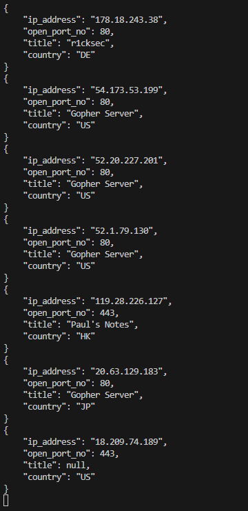

# Docker 🐳 

## Overview
***criminalip_docker.py*** is a program that retreives *docker* related assets(e.g. IP, Port, Title, Country) using criminal ip banner search api

## Prerequisites
Go to [criminalip.io](criminalip.io), sign up and get Criminal IP API Key
API Key itself is free and if you have account they automatically assign you one.

## Installation and Setup / Usage
Put the api key value that you got from criminal ip, to the variable ```x-api-key``` in the ```criminalip_docker.py``` file

> [!TIP]
> If you have additional criminal ip search queries that you want to use, you can manually add them by putting them to the ```QUERY_LIST```

## How to get started
Execute the file ```criminalip_docker.py```

## Screenshot


<details open>
  <summary><i>Extra Tips</i></summary>
  By default, the offset value of base_url is limited to max of "100".
  If you want more IP and Port information, you can reset the limit value. </details>


----

Hope you enjoy!

If you are interested in fetching other type of assets like Webcam or Printer, check out my other repositories in [criminalIP_find_Application](https://github.com/Whatnotkkachi7/criminalIP_find_Application)